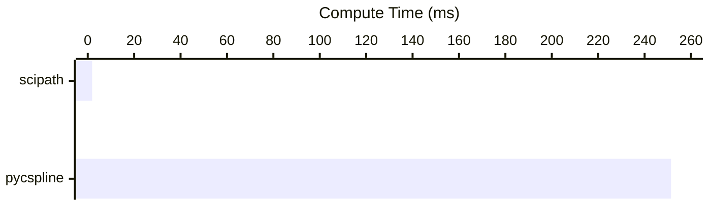

# scipath

[](https://github.com/astral-sh/uv)
[](https://www.python.org/)
[](https://github.com/winstxnhdw/scipath/actions/workflows/main.yml)
[](https://github.com/winstxnhdw/scipath/actions/workflows/formatter.yml)

> [!WARNING]\
> You should never use `scipath` in production. The API may change at any time and there are no plans for releases with semantic versioning. This package is intended for generating animations in my legacy autonomous vehicle projects.

`scipath` is a lightweight typesafe wrapper for SciPy's [CubicSpline](https://docs.scipy.org/doc/scipy/reference/generated/scipy.interpolate.CubicSpline.html). This wrapper simplifies the interpolation of coarse path data and allows the user to solely compute the profile of the path, such as path curvature and yaw. For large paths, it can be up to 300x faster than Atsushi Sakai's [PyCubicSpline](https://github.com/AtsushiSakai/pycubicspline).

<div align="center">
    
</div>

## Installation

```bash
pip install git+https://github.com/winstxnhdw/scipath
```

## Usage

`scipath` is fast because it heavily relies on NumPy broadcasting and lazily computes the expensive $p'(x)$ and $p''(x)$ only once. The following example demonstrates how to use `scipath`.

```python
from scipath import Profile, create_cubic_path_2d

points = [(0, 0), (1, 1), (2, 0), (3, 1)]
path = create_cubic_path_2d(points, profile=Profile.ALL)

print(path['path'])
print(path['yaw'])
print(path['curvature'])
```

To reduce the necessary computation required, you can specify a subset of the profiles you want to compute.

```python
from scipath import Profile, create_cubic_path_2d

points = [(0, 0), (1, 1), (2, 0), (3, 1)]
create_cubic_path_2d(points, profile=Profile.PATH)
create_cubic_path_2d(points, profile=Profile.YAW)
create_cubic_path_2d(points, profile=Profile.CURVATURE)
create_cubic_path_2d(points, profile=Profile.NO_CURVATURE)
create_cubic_path_2d(points, profile=Profile.NO_YAW)
create_cubic_path_2d(points, profile=Profile.NO_PATH)
```

## Benchmarks

In our benchmarks, we compare against Atsushi Sakai's [PyCubicSpline](https://github.com/AtsushiSakai/pycubicspline), and found that `scipath` is ~250x faster.



<br></br>
You may replicate the benchmark results with the following.

```bash
git clone --recursive https://github.com/winstxnhdw/scipath.git
cd scipath
uv run benchmarks/benchmark.py
```
